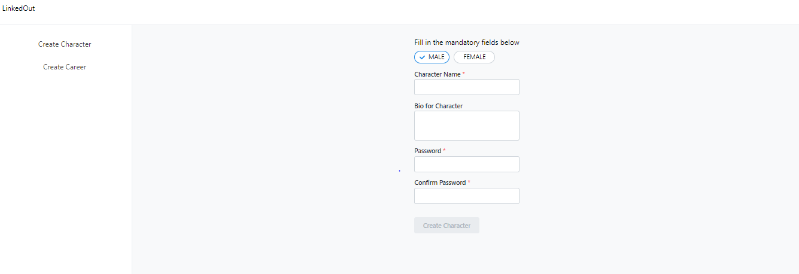
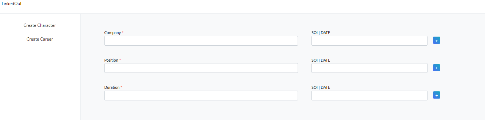

# Proof Of Concept Project

# Introduction

To create a reusable form component using react-hook-form and Mantine-UI that has the following

- Standardized Display of Label, Description, Tooltip and Error
- Disabling form elements while form is being submitted
- Error message can render links to another page
- Abstraction for forms to be saved in local storage if it is not submitted
- Prevents user from closing the tab/page if they are in a dirtied form
- Show mandatory fields

<br>

This Proof of Concept consists of two main pages which demostrates how the form can be used

- Create Character Page
- Create Career Page

<br>

### Create Character Page

A page to demo the basic validations and how the Form component is used in a standard Form.



<br>

### Create Career Page

A page to demo more complicated validations and how the Form component is used in a more nested Form.



<br>
<br>

# Tech Stack

- React 18
- TypeScript 4.5
- react-hook-form
- Mantinue UI (Main UI library used)
- Webpack (React Project set up, NO CRA)
- CSS Modules

<br>
<br>

# Usage of Form Component

The form components leverages on the concept of Compound Components in React

https://blog.logrocket.com/understanding-react-compound-components/

Sample usage of Form Component in conjunction with react-hook-form

```
// Form is found in src/components/Form

// declare methods from react hook form
const methods = useForm<YourSchemaType>({});
const { control } = methods;

<Form
 methods={methods}
 preventLeaving={true}
 useLocalStorage={true}
>
    <Form.TextInput control={control} />
    <Form.ChipSelection control={control} />
    <Form.TextArea control={control} />
    <Form.Dropdown control={control} />

</Form>

```

<br>
<br>

# Learning Points & TLDR from React-Hook-Form Documentation

- This portion aims to highlight the main hooks used and what are some key points to note when using the hooks. Aims to get you up to speed without digging through the entire documentation.

### `useForm`

`formState`

- `isDirty`: Returns boolean, check if forms is dirty, require default values to be set as underlying it uses deep copy to check.
- `dirtyFields`: Returns object of dirtied fields with key being the fieldName and value being a boolean.
- `touchedFields`: Return object, if you focused the field before, it will change to true for the particular field name
- `isValid`: Returns boolean, only works if you used mode: "onChange"

<br>

### `useController`

- Used for creating reusable Controlled Input
- Literally just powers `Controller` https://react-hook-form.com/api/usecontroller/controller

<br>
