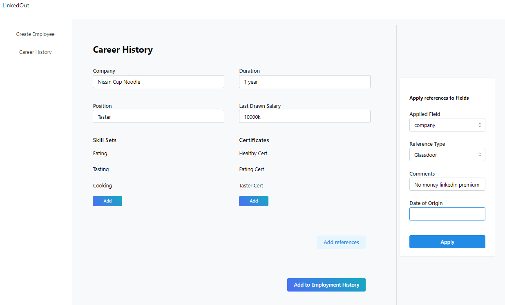

# Proof Of Concept Project

1. [Objectives](#1-objectives)
2. [Tech Stack](#2-tech-stack)
3. [How to Start](#3-how-to-start)
4. [Application Outline](#4-application-outline)
5. [Usage of Abstracted/Custom Form Component](#5-usage-of-abstractedcustom-form-component)
6. [Learning Points from React-Hook-Form](#6-learning-points--tldr-from-react-hook-form-documentation)

<br>

# 1. Objectives

1. To show solution on Form Abstractions using `react-hook-form`, `mantine` and `zod`. Main idea is create a reusable form component using react-hook-form and Mantine-UI that has the following

   - Standardized Display of Label, Description, Tooltip and Error
   - Disabling form elements while form is being submitted
   - Error message can render links to another page
   - Abstraction for forms to be saved in local storage if it is not submitted
   - Prevents user from closing the tab/page if they are in a dirtied form
   - Show mandatory fields

<br>

2. Testing and experimenting complexity of handling nested MongoDB Schema on the Frontend Side (with forms)

   - To ensure the form can handle the data structure as shown

     ```
     {
         field1: "content1",
         field2: "content2",
         field3: ["item1", "item2"]
         ref: [
             {
                 appliedTo: "content1",
                 comment: "rara"
             },
             {
                 appliedTo: "content2",
                 comment: "rara2"
             },
             {
                 appliedTo: "item1",
                 comment: "rara3"
             },
             {
                 appliedTo: "item2",
                 comment: "rara4"
             }
         ]
     }
     ```

<br>

# 2. Tech Stack

- React 18
- TypeScript 4.5
- react-hook-form
- Mantinue UI (Main UI library used)
- Webpack (React Project set up, NO CRA)
- CSS Modules (might update to emotion if time permits)

<br>

# 3. How to Start

1. Install Node (v16 and above)
2. Ensure yarn is installed

```
npm install --global yarn
yarn --version
```

3. Install Dependencies

```
yarn install
```

4. Start Webpack Dev Server

```
yarn watch
```

Go to: http://localhost:3000

<br>

# 4. Application Outline

<br>

This Proof of Concept consists of two main pages which demostrates how the form can be used

- Create Employee Page
- Career History Page

<br>

### Why a Specific Form Component when we already are using a UI library + React Hook Form?

1. Ability to use implicit states by leveraging on React Context
2. Ease of reusability across the entire team.
3. Seperation of concerns between components (A form specific component/compound component is to be used as a context of a Form only).
4. Extension of custom form components if required

<br>

### Create Employee Page

A page to demo the basic validations and how the Abstracted/Custom Form component is used in a standard Form.


<br>

### Career History Page

A page to demo more complicated validations and how the Abstracted/Custom Form component is used in a more nested Form.



<br>
<br>

# 5. Usage of Abstracted/Custom Form Component

The form components leverages on the concept of Compound Components in React

https://blog.logrocket.com/understanding-react-compound-components/

Sample usage of Form Component in conjunction with react-hook-form

```
// Form is found in src/components/Form

// declare methods from react hook form
const methods = useForm<YourSchemaType>({});
const { control } = methods;

<Form
 methods={methods}
 preventLeaving={true}
 useLocalStorage={true}
>
    <Form.TextInput control={control} />
    <Form.ChipSelection control={control} />
    <Form.TextArea control={control} />
    <Form.Dropdown control={control} />

</Form>

```

<br>

# 6. Learning Points & TLDR from React-Hook-Form Documentation

- This portion aims to highlight the main hooks used and what are some key points to note when using the hooks. Aims to get you up to speed without digging through the entire documentation.

### `useForm`

`formState`

- `isDirty`: Returns boolean, check if forms is dirty, require default values to be set as underlying it uses deep copy to check.
- `dirtyFields`: Returns object of dirtied fields with key being the fieldName and value being a boolean.
- `touchedFields`: Return object, if you focused the field before, it will change to true for the particular field name
- `isValid`: Returns boolean, only works if you used mode: "onChange"

<br>

### `useController`

- Used for creating reusable Controlled Input
- Literally just powers `Controller` https://react-hook-form.com/api/usecontroller/controller

<br>
